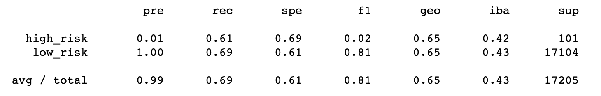
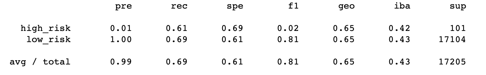
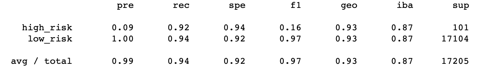

# Credit_Risk_Analysis

## Overview of the Analysis

The purpose of this analysis is to analyze a credit card credit dataset from a company called LendingClub, which is a peer to peer lending service. We will use a number of different algorithms to analyze the data and predict credit risk. Then we will look at the performance of the models and recommend which should be used to predict credit risk in this situation. 

## Results

- Naive Random Oversampling 
  - Balanced Accuracy Score is approx 64%
  - The high risk precision is approx 1% only with 66% sensitivity.
  - The low risk precision is almost 100% with a sensitivity of 62% as shown below 
  

- SMOTE Oversampling 
  - Balanced Accuracy Score is approx 65.1%
  - The high risk precision is approx 1% only with 61% sensitivity.
  - The low risk precision is almost 100% with a sensitivity of 69% as shown below 
  

  
- ClusterCentroids Undersampling
  - Balanced Accuracy Score is approx 65.1%
  - The high risk precision is approx 1% only with 61% sensitivity.
  - The low risk precision is almost 100% with a sensitivity of 69% as shown below 
  

  
- SMOTEENN Sampling 
  - Balanced Accuracy Score is approx 65.1%
  - The high risk precision is approx 1% only with 61% sensitivity.
  - The low risk precision is almost 100% with a sensitivity of 69% as shown below 
  

  
- Balanced Random Forest Classifier
  - Balanced Accuracy Score is approx 78.9%
  - The high risk precision is approx 3% only with 70% sensitivity.
  - The low risk precision is almost 100% with a sensitivity of 87% as shown below 
  

- Easy Ensemble AdaBoost Classifier 
  - Balanced Accuracy Score is approx 93.2%
  - The high risk precision is approx 9% with 92% sensitivity.
  - The low risk precision is almost 100% with a sensitivity of 94% as shown below 
  

## Summary

The recommendation given would be to spend more time finding other predictive models to accurately predict credit risk. All models show a low high risk precision.

